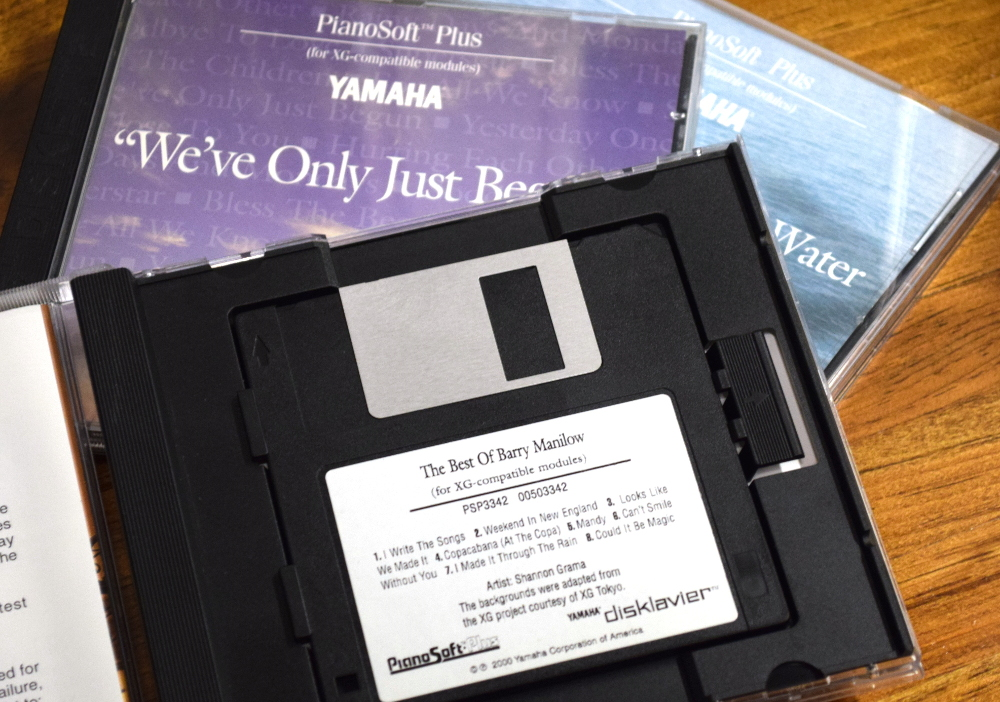

Dislavier Disk Image Tool
=========
This is a Python script for working with 3.5 inch Disklavier floppy disks on Linux. In theory it should work with physical disks, but all testing has been done against images created with [GNU ddrescue](https://www.gnu.org/software/ddrescue/).

It currently supports Smart PianoSoft and PianoSoft Plus disks, and has a success rate of roughly 90% against the library of physical disks I have access to.

Dependencies
=========
This program is written for Python 3.x, and requires the installation of the [bitstring library](https://pythonhosted.org/bitstring/index.html).

Usage
=========
Running disklav.py with no options will output the automatically detected disk type as well as the title.

The following additional arguments are available:

#### -t
List the tracks as they appear in the disk's Table of Contents.

#### -l
Attempt to automatically locate individual MIDI or E-Seq files on the disk. This argument shows the starting position and length for each track, given in bytes. These values can be used in conjunction with the dd command to extract individual tracks.

#### -e
Attempt to automatically extract all MIDI or E-Seq files on the disk. Files will be dumped to current working directory, and use the filename of the disk image as the prefix.

License
=========
This program is free software; you can redistribute it and/or modify it under the terms of the GNU General Public License version 3 as published by the Free Software Foundation.

This program is distributed in the hope that it will be useful, but WITHOUT ANY WARRANTY; without even the implied warranty of MERCHANTABILITY or FITNESS FOR A PARTICULAR PURPOSE.

For details, see the file "COPYING" in the source directory.
